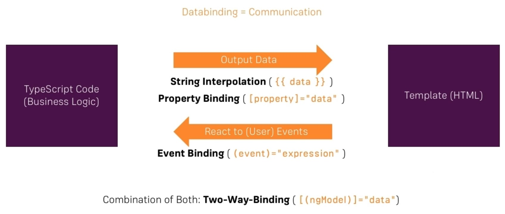

# Basics

## Notes

### CLI Commands

**Creating a new application**

``` ng new <application-name> ```

**Running the server**

``` ng serve ```

*Application will be available at http://localhost:4200*

**Installing new node modules**

``` npm install <module-name> ```

**Create new components**

``` ng generate component <component-name> ```

or

``` ng gc <component-name> ```

 ***Application execution starts at main.ts***

***Convert any class into Module or Component using decorators like:***
- @NgModule()
- @Component()
### Components

- **Components needs to be declared in declaration section of @NgModule in app.module.ts**

- **Different ways of specifying component selectors :**

    TS:
    - selector: 'app-servers' &nbsp;&nbsp;&nbsp;&nbsp;*Element Selector*
    - selector: '[app-servers]' &nbsp;&nbsp;&nbsp;&nbsp;*Attribute Selector*
    - selector: '.app-servers' &nbsp;&nbsp;&nbsp;&nbsp;*Class Selector*

    HTML:
     - ```<app-servers></app-servers>``` &nbsp;&nbsp;&nbsp;&nbsp;*Element Selector*
     - ```<div app-servers></div>``` &nbsp;&nbsp;&nbsp;&nbsp;*Attribute Selector*  
     - ```<div class="app-servers"></div>``` &nbsp;&nbsp;&nbsp;&nbsp;*Class Selector*

### Databinding
<br/>



### Directives

- **Types :**

    - **Components directives** : directives with a template.
    - **Attribute directives** : directives that change the appearance or behavior of an element, component, or another directive.
    - **Structural directives** :directives that change the DOM layout by adding and removing DOM elements. Will have * in starting.

- **Built-in attribute directives :** ngClass, ngStyle, ngModel, etc

- **Built-in structural directives :** *ngIf, *ngFor, *ngSwitch
    - *ngIf="isActive"
    - *ngFor="let item of items" or *ngFor="let item of items; let i=index"
    - *ngSwitchCase="'bright'"
