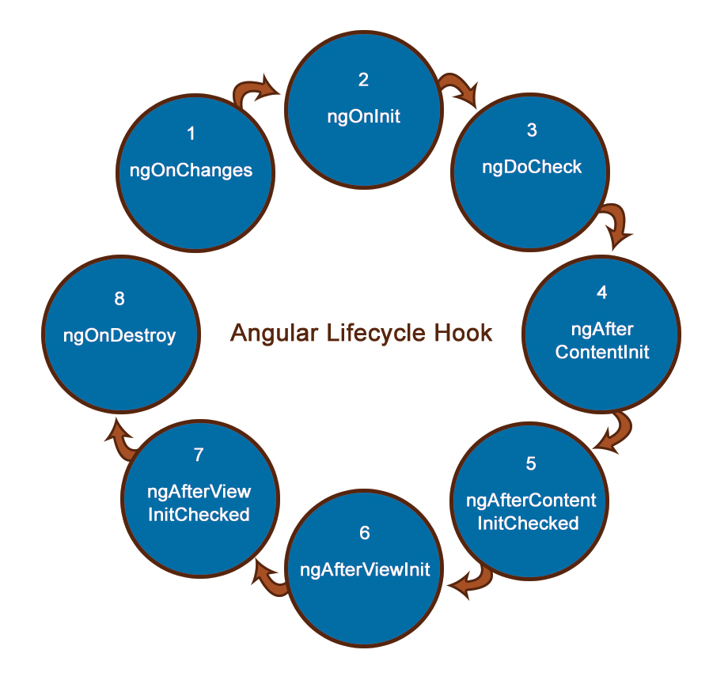

# ComponentsAndDatabinding

## Component Lifecycle
<br>


## Component Interaction

- ### Passing data from Parent to Child Component

    - Child Component TS
        ``` typescript
        export class HeroChildComponent {
            @Input() hero: Hero;
        } 
        ```
    -   Parent Component HTML
        ``` HTML
        <app-hero-child *ngFor="let hero of heroes"
            [hero]="hero"> </app-hero-child>
        ```

- ### Passing data from Child to Parent Component
    The child component exposes an EventEmitter property with which it emits events when something happens. The parent binds to that event property and reacts to those events.

    - Child Component
        ``` HTML
        <button (click)="vote(true)"  [disabled]="didVote">Agree</button>
        <button (click)="vote(false)" [disabled]="didVote">Disagree</button>
        ```
        ``` typescript
        export class ChildComponent {
             @Output() voted = new EventEmitter<boolean>();
             vote(agreed: boolean) {
                this.voted.emit(agreed);
            } 
        } 
        ```
    -   Parent Component
        ``` HTML
        <app-voter *ngFor="let voter of voters"
        [name]="voter"
        (voted)="onVoted($event)">
        </app-voter>
        ```

        ``` typescript
        export class VoteTakerComponent {
            agreed = 0;
            disagreed = 0;
            onVoted(agreed: boolean) {
                agreed ? this.agreed++ : this.disagreed++;
            }
        }
        ```
- ### Parent interacts with child via local variable
    Creating a template reference variable for the child element and then reference that variable within the parent template
    - Child Component
        ``` typescript
        stop()  {
            this.clearTimer();
        } 
        ```
    -   Parent Component
        ``` HTML
        <button (click)="timer.stop()">Stop</button>
        <app-countdown-timer #timer></app-countdown-timer>
        ```
- ### Parent calls an @ViewChild()
    Injecting the child component into the parent as a ViewChild.

    -   Parent Component
        ``` typescript
        export class CountdownViewChildParentComponent implements AfterViewInit {
            @ViewChild(CountdownTimerComponent)
            private timerComponent: CountdownTimerComponent;
            start() { this.timerComponent.start(); }
        }
        ```